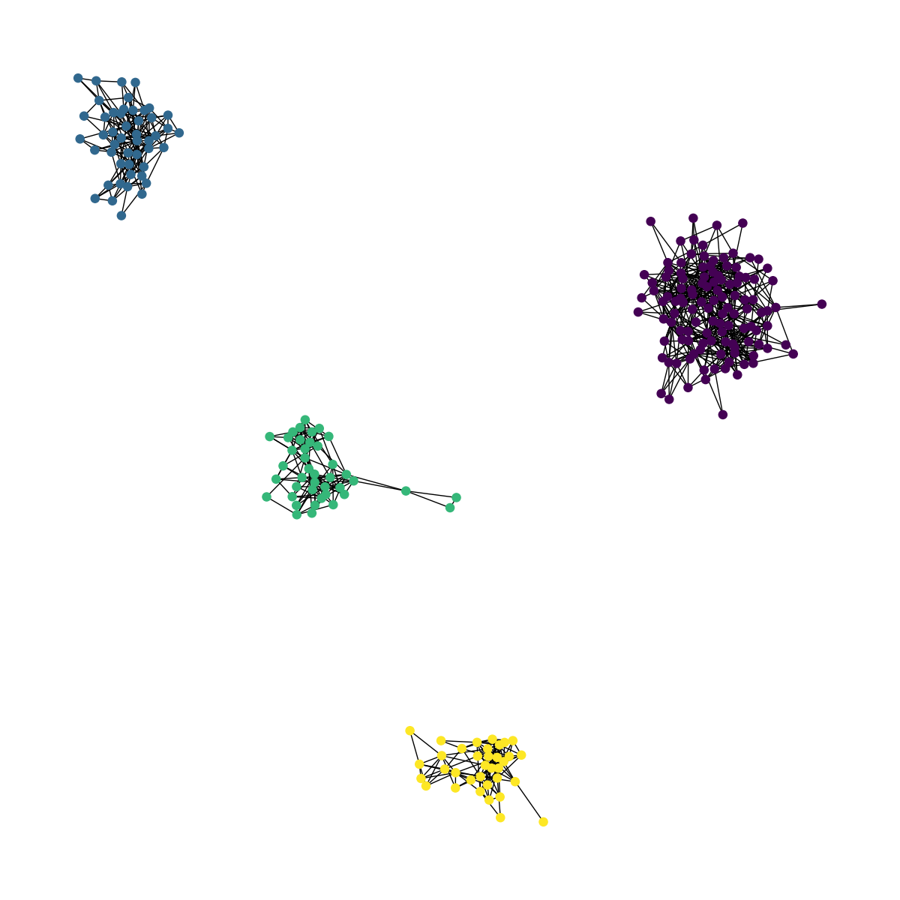

# spectral-clustering

## Introduction

Re-implementation of the paper titled [On Spectral Clustering: Analysis and an algorithm](https://proceedings.neurips.cc/paper/2001/file/801272ee79cfde7fa5960571fee36b9b-Paper.pdf) by AY Ng et al. from NIPS 2001.

## Data

- ```example1.dat```:  This data set was prepared by Ron Burt. He dug out the 1966 data collected by Coleman, Katz and Menzel on medical innovation. They had collected data from physicians in four towns in Illinois, Peoria, Bloomington, Quincy and Galesburg.
- ```example2.dat```: A synthetic graph.

The graphs are defined by edges in the data files, and both are undirected.

## Method

As discussed in the paper. 


## How to Run

Install the dependencies from the virtual environment defined in ```environment.yml```.
Then, for instance, run on ```example1.dat```:

```commandline
python main.py --dataset_name example1 --seed 123
```

or on ```example2.dat```:

```commandline
python main.py --dataset_name example1 --seed 123
```

## Results

### Example1 (4 clusters)

Affinity (adjacency) matrix of graph g:


Fiedler vector (2nc eigenvector) of adjacency matrix:


Eigenvalues in ascending order of adjacency matrix:


Clusters in graph g found via spectral clustering:



### Example1

Affinity (adjacency) matrix of graph g:


Fiedler vector (2nc eigenvector) of adjacency matrix:


Eigenvalues in ascending order of adjacency matrix:


Clusters in graph g found via spectral clustering:


